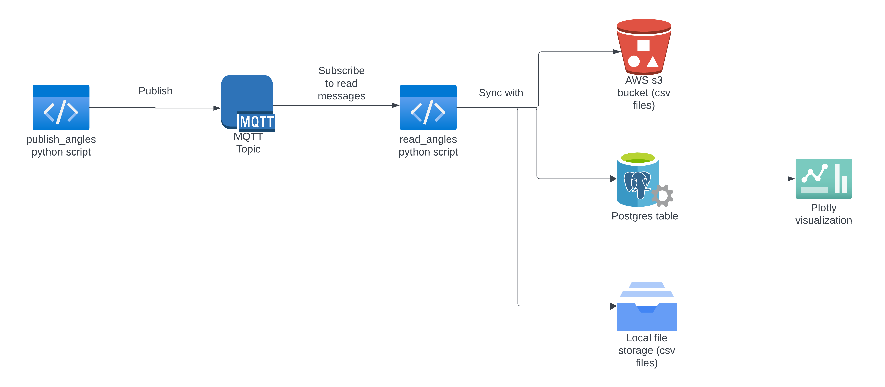

# UR5 Data Pipeline



This project is a data pipeline that publishes and reads angles for a robot arm into and from an MQTT broker After reading angles, stores them in a postgres database and csv files on local storage and uploads them to an S3 bucket. 

The project consists of three scripts: 
- `publish_angles.py`: The `publish_angles.py` script publishes random angles to the MQTT broker every 0.1 seconds based on sine function. 
- `read_angles.py`: The `read_angles.py` script reads the angles from the MQTT broker, stores them in a postgres database and local csv file, and uploads them to an S3 bucket **if AWS credentials are provided**. Evety time the script reads 10 entries, it will load the angles into mentioned storages. This will ensure that in a close to real-time scenario, the angles are stored in the database and uploaded to the S3 bucket.
- `data_visualization`: The `data_visualization` script reads the angles from the postgres database in real time and visualizes them using plotly dash.


# Run the project

To run the project, follow these steps:


### Create the database

```bash
docker-compose up --build -d
```

This will start a postgres database which will be used to store angles data.

### Setup MQTT broker

Using MacOS, you can install and run mosquitto using brew.

```bash
brew install mosquitto
brew services start mosquitto
```

### install python dependencies

```bash
pip install -r requirements.txt
```

### start the publisher

```bash
python publish_angles.py
```

This script will publish random angles to the MQTT broker every 0.1 seconds. Run this in a separate terminal.

### start the reader

```bash
python read_angles.py
```

Run this script in a separate terminal.

This script will read the angles from the MQTT broker. On exit, the script will dump the angles into a postgres database and local csv file. If AWS S3 credentials are provided (by setting `AWS_ACCESS_KEY_ID` and `AWS_SECRET_ACCESS_KEY` environment variables), the script will also upload the csv file to an S3 bucket.


### start the data visualization

```bash
python data_visualization.py
```

This script will read the angles from the postgres database and visualize them using plotly dash. You can access the visualization by visiting `localhost:8050` in your browser. Run this script in a separate terminal as well.

## stop the project and clean up

To stop the project, you can use docker-compose with the following command:

```bash
docker-compose down --rmi all
```

# Explanation of files in the project

The project contains the following files:

- `requirements.txt`: Contains the python dependencies required to run the project.
- `docker-compose.yml`: Contains the configuration for the postgres database.
- `publish_angles.py`: Contains the script to publish random angles to the MQTT broker.
- `read_angles.py`: Contains the script to read angles from the MQTT broker and store them in a postgres database and local csv file, also upload the csv file to an S3 bucket if AWS credentials are provided.
- `utils.py`: Contains utility functions used by the scripts, such as function to create postgres table, function to dump angles to s3 bucket, function for creating logs etc.